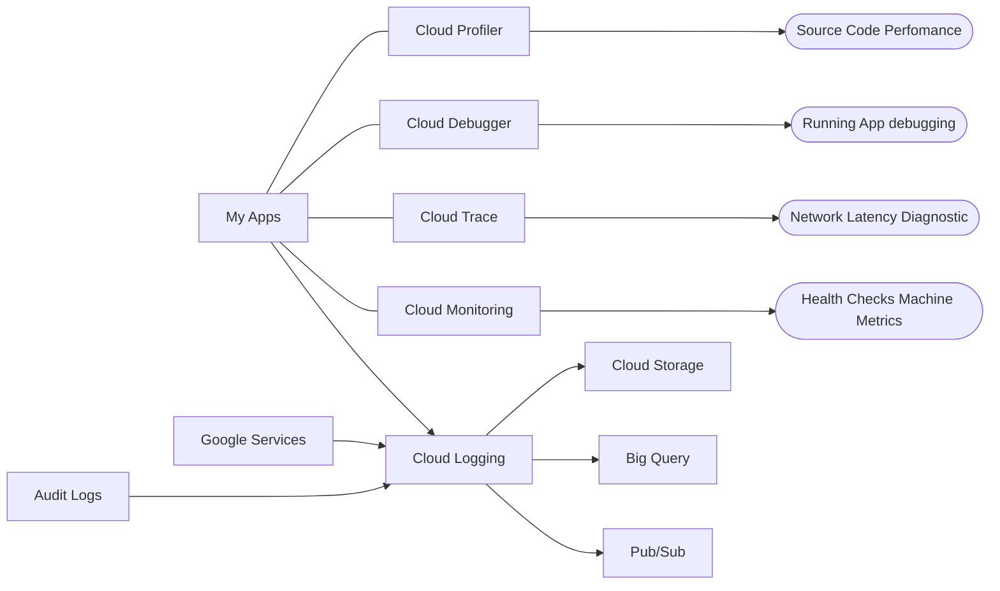

# Operations Suite

### Cloud Logging
- Cetralized location for logs
  - Application Logs
  - GKE Custom Logs

### Cloud Monitoring
- Overall Health of application/ Infrastructure
  - CPU
  - Memory
  - Health
- Set SLOs and Alerts

### Cloud Trace
- *Open Telemetry* *Open Census*
- Netowork latency 
- API performance
- Distributed system

### Cloud Profiler
- Source code level performance diagnostics
- A function takes up this amount of Memory/CPU

### Cloud Debugger
- Identify Errors in a running application
- **Does not require restarting system**
  - Logpoints
    - Inject log statements into applications
  - Snapshots
    - View the call stack and analyze local variables

### Managed Prometheus
- Google managed version of Prometheus for GKE
  - Promethus is metrics for Kubernetes
- Highly Scalable

### Audit Logs
- Logs about editing resources in Google Cloud

