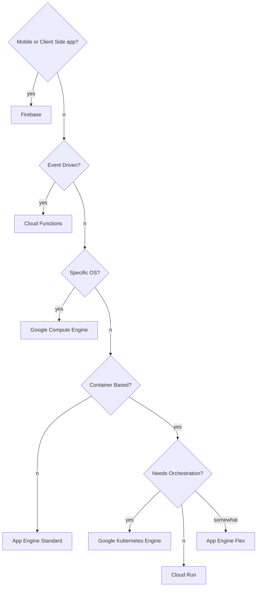

# Computing

```mermaid

    flowchart TD
        firebase[Firebase]
        cloudFunctions[Cloud Functions]
        gce[Google Compute Engine]
        cloudRun[Cloud Run]
        gke[Google Kubernetes Engine]
        appEngineFlex[App Engine Flex]
        appEngineStandard[App Engine Standard]
        isMobileOrClientSideApp{Mobile or Client Side app?}
        isEventDriven{Event Driven?}
        isOsSpecific{Specific OS?}
        isContainerBased{Container Based?}
        containerOrchestration{Needs Orchestration?}
        

        isMobileOrClientSideApp --yes --> firebase
        isMobileOrClientSideApp --no-->isEventDriven
        isEventDriven --yes--> cloudFunctions
        isEventDriven --no--> isOsSpecific
        isOsSpecific --yes-->gce
        isOsSpecific --no-->isContainerBased
        isContainerBased --no-->appEngineStandard
        isContainerBased --yes--> containerOrchestration
        containerOrchestration --yes--> gke
        containerOrchestration --no--> cloudRun
        containerOrchestration --somewhat--> appEngineFlex


```