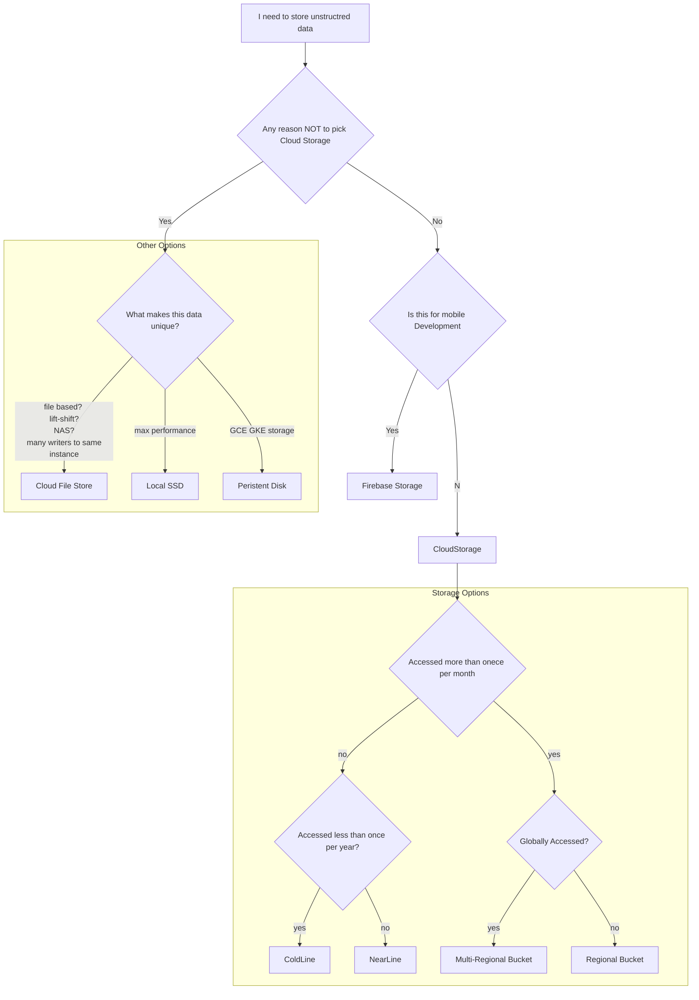

# Data Storage
Cloud Storage is the best storage option for most use cases. It should be the default option. It is
- Infinitely Scalable
- Cost Efficient
- Fully Managed by Google
- Reliable 
- Fast enough for most users 

# Choosing A storage Type
