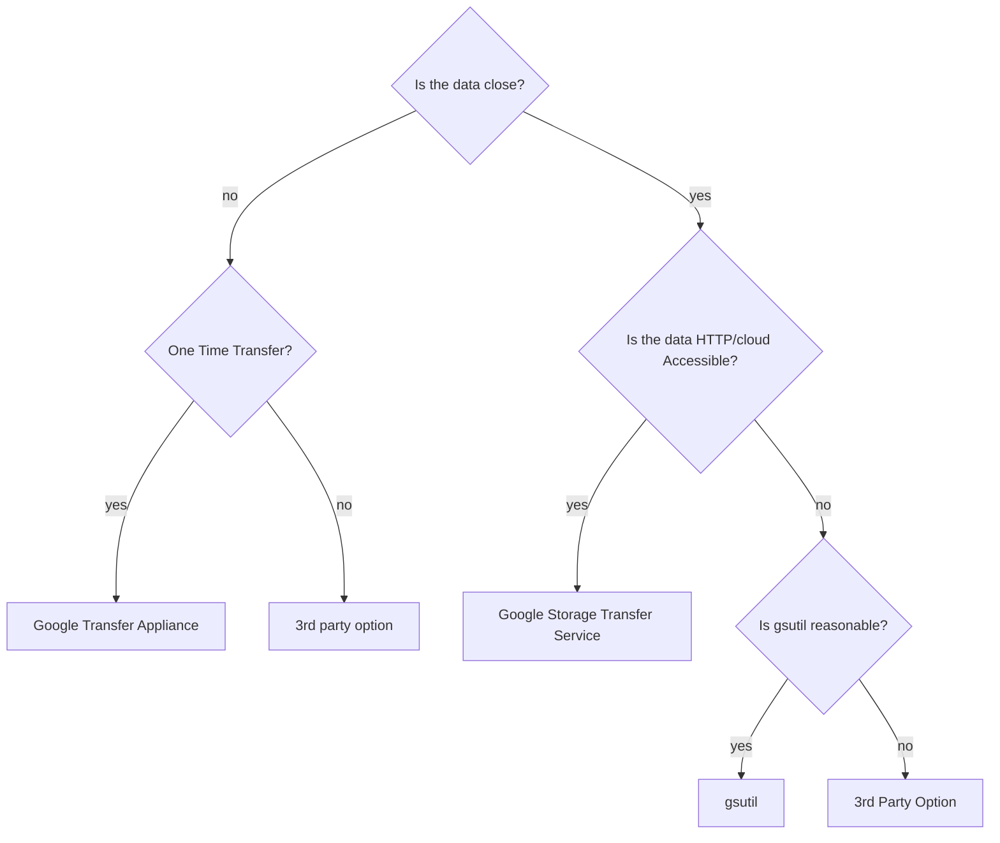

# Data Transfers
- Close data
  - data transfer by internet would take seconds to hours.
- Far data 
  - data transfer by internet would takes days to months 

```mermaid

    flowchart TD
        applicance[Google Transfer Appliance]
        transerService[Google Storage Transfer Service]
        isClose{Is the data close?}
        isOneOff{One Time Transfer?}
        isInternetAccessible{Is the data HTTP/cloud Accessible?}
        3rdParty[3rd party option]
        
        isClose -- no  --> isOneOff
        isOneOff -- yes --> applicance
        isOneOff -- no --> 3rdParty

        isClose -- yes --> isInternetAccessible
        isInternetAccessible -- yes --> transerService
        isInternetAccessible -- no --> isGsutil{Is gsutil reasonable?}
        isGsutil -- yes --> gsutil
        isGsutil -- no --> 3rdParty2[3rd Party Option]

```