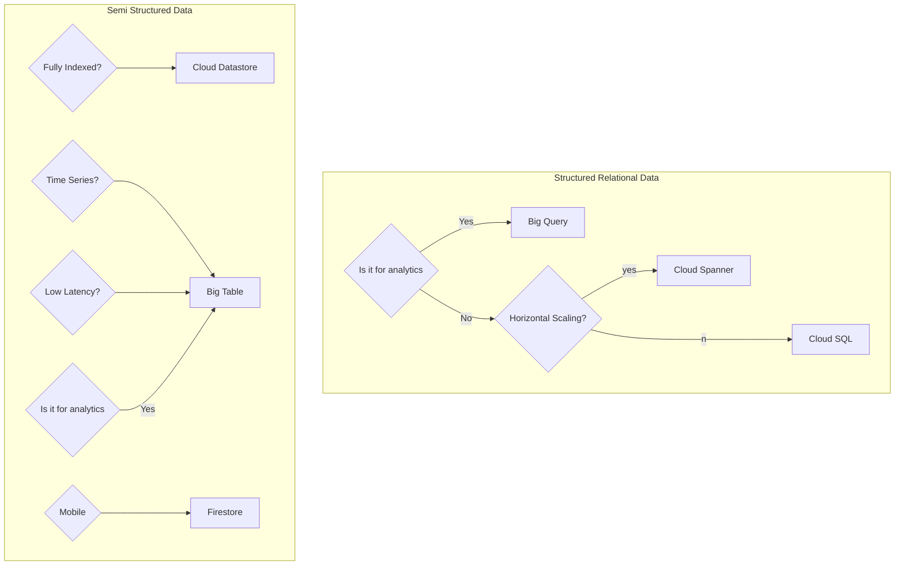

# Database Flow

```mermaid

flowchart TD
    BQ[Big Query]
    SQL[Cloud SQL]
    Spanner[Cloud Spanner]
    Store[Cloud Datastore]
    BT[Big Table]

    subgraph Structured Relational Data
        Analytics{Is it for analytics}
        Analytics --Yes --> BQ
        Analytics -- No --> global{Horizontal Scaling?} 
        global --no--> SQL
        global --yes--> Spanner
    end

    subgraph Semi Structured Data
        
        time{Time Series?} -->BT
        index{Fully Indexed?} -->Store
        mobile{Mobile} --> Fire[Firestore]
        update{Low Latency?} --> BT
        Analytics2{Is it for analytics}--Yes --> BT
    end

```