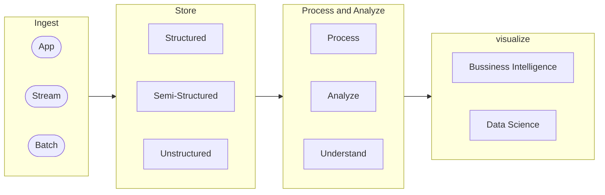

# Data Lifecycle

```mermaid

    flowchart LR

    subgraph Ingest
        direction RL
        App([App])
        Stream([Stream])
        Batch([Batch])
    end

    subgraph Store
        direction RL
        Structured
        Semi-Structured
        Unstructured
    end
    Ingest --> Store

    subgraph process[Process and Analyze]
        direction RL
        Process
        Analyze
        Understand
    end
    Store --> process

    subgraph visualize
        direction RL
        Bus[Bussiness Intelligence]
        Science[Data Science]
    end
    
    process --> visualize

        


```