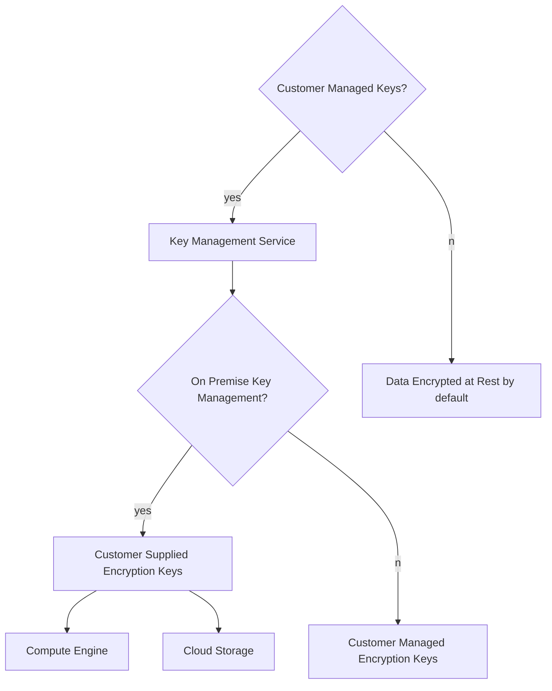

```mermaid

    flowchart TD

        CustomerKeyManagement{Customer Managed Keys?}
        onsite{On Premise Key Management?}

        CustomerKeyManagement --yes--> KMS[Key Management Service] --> onsite
        
        onsite --yes--> CSEK[Customer Supplied Encryption Keys]
        onsite --no--> CMEK[Customer Managed Encryption Keys]

        CSEK --> compute[Compute Engine]
        CSEK --> storage[Cloud Storage]


        CustomerKeyManagement --no--> en[Data Encrypted at Rest by default]


```