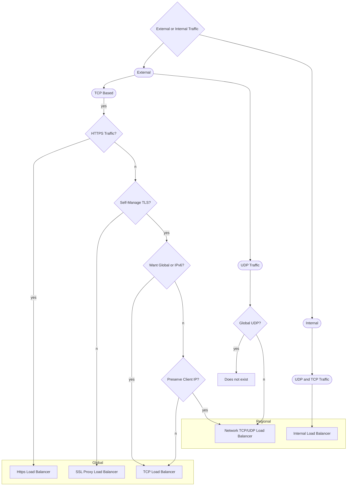

# Load Balancers

```mermaid

    flowchart TD
        httpsLoadBalancer[Https Load Balancer]
        internalLoadBalancer[Internal Load Balancer]
        sslProxyLoadBalancer[SSL Proxy Load Balancer]
        tcpLoadBalancer[TCP Load Balancer]
        newtorkLoadBalancer[Network TCP/UDP Load Balancer]
        trafficSource{External or Internal Traffic}
        external([External])
        internal([Internal])
        isTCP([TCP Based])
        isUDP([UDP Traffic])
        isHTTPS{HTTPS Traffic?}
        customTLS{Self-Manage TLS?}
        wantGlobalIPV{Want Global or IPv6?}
        preserveClientIP{Preserve Client IP?}
        udpAndTCP([UDP and TCP Traffic])

        trafficSource --> external
        trafficSource --> internal
        external --> isTCP
        external --> isUDP
        isTCP --yes--> isHTTPS
        isHTTPS --yes--> httpsLoadBalancer
        isHTTPS --no--> customTLS
        customTLS --no--> sslProxyLoadBalancer
        customTLS --yes--> wantGlobalIPV
        wantGlobalIPV --yes--> tcpLoadBalancer
        wantGlobalIPV --no--> preserveClientIP
        preserveClientIP --no-->tcpLoadBalancer
        preserveClientIP --yes-->newtorkLoadBalancer
        isUDP --> udpGlobal{Global UDP?}
        udpGlobal --yes--> noExist[Does not exist]
        udpGlobal --no--> newtorkLoadBalancer
        internal --> udpAndTCP
        udpAndTCP --> internalLoadBalancer

        

    subgraph Regional
        newtorkLoadBalancer
        internalLoadBalancer
    end

    subgraph Global
        httpsLoadBalancer
        sslProxyLoadBalancer
        tcpLoadBalancer
    end

```