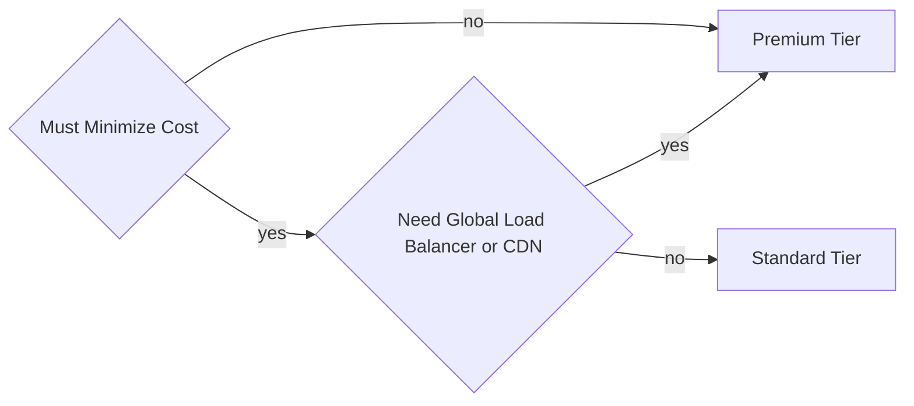

# Network Tiers
Premium tier is objectively better in every way except cost. Certain global services are only available with Premium Tier.

```mermaid

    flowchart LR
        standardTier[Standard Tier]
        premiumTier[Premium Tier]
        isCostSensititve{Must Minimize Cost}
        hasGlobalResource{Need Global Load Balancer or CDN}

        isCostSensititve -- no --> premiumTier
        isCostSensititve -- yes --> hasGlobalResource
        hasGlobalResource -- yes --> premiumTier
        hasGlobalResource -- no --> standardTier

```