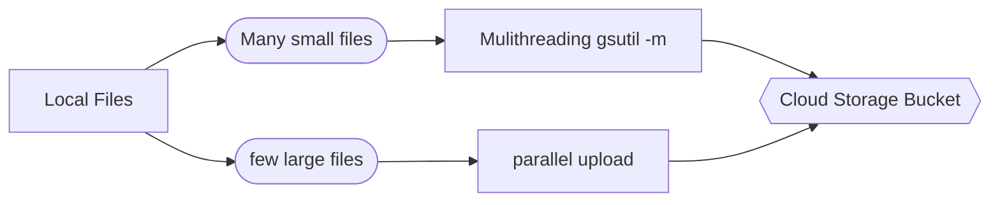

```mermaid

    flowchart LR

        files[Local Files]

        files --> many([Many small files])
        files --> few([few large files])

        many -->multi[Mulithreading gsutil -m]
        few -->para[parallel upload]

        multi --> bucket
        para --> bucket

        bucket{{Cloud Storage Bucket}}


```