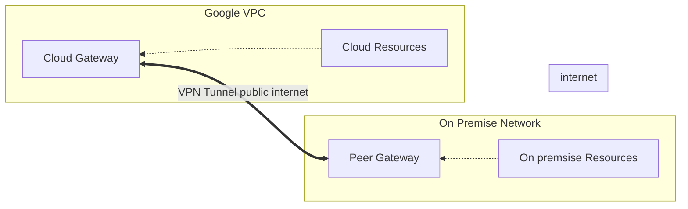

# VPN
- VPN
  - Virtual Private Network
  - Connects your on-premise networks/machines to the cloud
  - Allow developers/SREs access to cloud resources as a private IP
  - For smaller traffic 1.5gbps
- Interconnect
  - Connect on-premise networks/machines to the cloud
  - Interconnect provides higher throughput
  - Dedicated Interconnect
    - Direct link to google edge location
  - Partner Interconnect
    - Link to a provider that sends it to a google edge location

